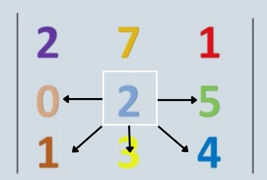
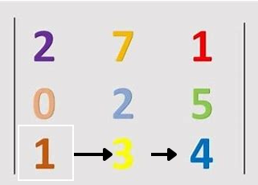
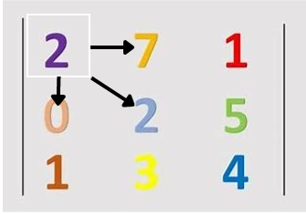
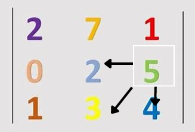
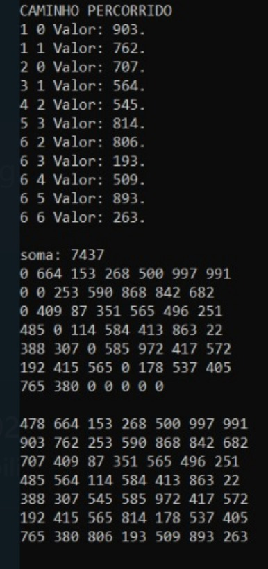

# Caminho Guloso: Implementação em C++

<div style="display: inline-block;">
 
 
</a> 
</div>

# Problema Proposto
<p align="justify">
  Utilizando o processo de caminhamento guloso, nesse projeto o objetivo e caminhar por matrizes NxN, passadas como entrada, iniciando pela posicao 0x0. O caminho passado sera o que apresentar o maior valor entre as opcoes em relacao a posicao atual: <br>
  - Caminhar a direita. <br>
  - Caminhar a esquerda. <br>
  - Caminhar para baixo. <br>
  - Caminhar na diagonal direita e esquerda para baixo. <br>
  Atraves dessas regras, o objetivo do programa apresentado e chegar na posicao NxN passando pelos maiores valores.
</p>

# Logica

A funcao princial ```ReadMat()``` e chamada no main, nesta funcao ocorrem todos os processos do programa, partindo da leitura do arquivo ```dataset/input.data``` ate a relizacao do processo de caminhamento guloso na matriz. <br>

Para a criacao da matriz foi utilizado um vector de vector inteiro.
  
  ```c++
    vector<vector<int>> mat;
  ```

Durante o processo de leitura do arquivo,que se encontra no arquivo ```Func.cpp``` que se esta na pasta ```src``` entre as linhas 21 a 52, ocorre o processo de tokenizacao das informacoes, e a passagem de string para int, passagem necessaria para a realizacao das acoes futuras do algoritmo. Estes processos que sao realizados caso o else do codigo nas linhas 43 a 50, nele estao as funcoes: <br>```Verificando``` que recebe como parametro a matriz, a posicao inicial da linha e coluna, o tamanho da matriz e o endereco da variavel soma total.<br> ```Imprimindo``` que recebe como parametro a matriz.<br> <br>

A funcao  Verificando  parte do pressuposto de que o caminho a ser percorrido deve ser entre os maiores valores, entre as opcoes, que estao na matriz. Para isso foi feito um vector ```vector<int> comparar``` que recebe os valores das posicoes a serem verificadas. Estes valores sao ordenados em ordem descrescente pela funcao sort ```sort(comparar.begin(), comparar.end(), greater<>())```, atraves dessa ordenacao, o maior valor entre os possiveis e colocado na primeira posicao do vector.<br><br>
Sabendo disso, uma leitura por toda matriz e realizada, nesta leitura busca-se o valor que esta na primeira posicao do vector, porem e valido ressaltar que pode ser que existam dois valores iguais e isso causaria um problema na logica, por isso uma condicao de que, caso a linha da atual posicao seja menor que a linha da leitura da matriz, o algoritmo torna possivel o recebimento da posicao. Ao achar o valor recebe a posicao linha e coluna, a posicao anterior recebe 0 para que seja marcado uma posicao ja verificada e o algoritmo soma 1 a uma varival auxiliar, esta que foi criada para interromper o loop de leitura da matriz, e retorna a soma dos valores das posicoes que foram passadas para realizar o encaminhamento ate a posicao NxN. Apos interromper a iteracao da repeticao esta finalizada a leitura da primeira matriz do arquivo, tornado possivel a iniciacao da leitura da proxima matriz do arquivo.<br><br>
<br>
Fig 1. Exemplo de funcionamento do Problema.<br>

 Todo este processo e feito enquanto a posicao linha coluna nao sao iguais a posicao NxN da matriz passada. <br>
 Em casos particulares, como:<br>
 1-Linha atual igual ultima linha da matriz.: <br>
  <br>
 Fig 2. Exemplo de possibilidades em caso de situacao especifica. <br> <br>
 2-Coluna atual igual primeira coluna da matriz. <br>
   <br>
  Fig 3. Exemplo de possibilidades em caso de situacao especifica. <br> <br>
 3- Coluna atual igual ultima coluna da matriz. <br>
   <br>
   Fig 4. Exemplo de possibilidades em caso de situacao especifica. <br> <br>
 Foram realizadas acoes permitidas somente para a posicao que se ocupava, para que o algoritmo nao acessasse posicoes indesejadas. <br>

  Este processo acontece enquanto a arquivo nao termina sua leitura, ou seja, para cada matriz no arquivo lido, e chamado uma vez a funcao verificando e a funcao imprimindo.

 # Resultados 
   Considerando os pontos realizados acima, os resultados esperados durante a leitura do arquivo com 4 matrizes 7x7:<br><br>
    <br>
   
 # Bibliotecas 
<p>Para o funcionamento do programa, é necessário incluir as seguintes bibliotecas: 
<ul>
    <li><code>#include 'iostream'</code></li>
    <li><code>#include 'fstream'</code></li>
    <li><code>#include 'vector'</code></li>
    <li><code>#include 'string'</code></li>
    <li><code>#include 'stream'</code></li>
    <li><code>#include 'iterator'</code></li>
    <li><code>#include 'algorithm'</code></li>
</ul>

# Compilação e Execução

Esse pequeno exemplo possui um arquivo Makefile que realiza todo o procedimento de compilação e execução. Para tanto, temos as seguintes diretrizes de execução:


| Comando                |  Função                                                                                           |                     
| -----------------------| ------------------------------------------------------------------------------------------------- |
|  `make clean`          | Apaga a última compilação realizada contida na pasta build                                        |
|  `make`                | Executa a compilação do programa utilizando o gcc, e o resultado vai para a pasta build           |
|  `make run`            | Executa o programa da pasta build após a realização da compilação                                 |


# Contatos

<div style="display: inline-block;">
<a href="https://t.me/felipewom">
 
</a>

<a href="https://www.linkedin.com/in/felipe-werneck-93520a209">

</a>

</div>

<p> </p>
