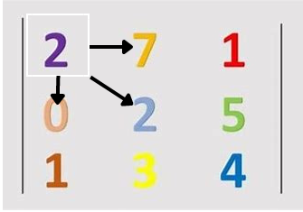

# Caminho Guloso: Implementação em C++

<div style="display: inline-block;">
 
 
</a> 
</div>

# Problema Proposto
<p align="justify">
  Utilizando o processo de caminhamento guloso, nesse projeto o objetivo é caminhar por matrizes NxN, passadas como entrada, iniciando pela posição 0x0. O caminho passado será o que apresentar o maior valor entre as opções em relação a posição atual: <br>
  - Caminhar à direita. <br>
  - Caminhar à esquerda. <br>
  - Caminhar para baixo. <br>
  - Caminhar na diagonal direita e esquerda para baixo. <br>
  Através dessas regras, o objetivo do programa apresentado e chegar na posição NxN passando pelos maiores valores.
</p>

# Lógica

A função principal ```ReadMat()``` é chamada no main, nesta função ocorrem todos os processos do programa, partindo da leitura do arquivo ```dataset/input.data``` até a relização do processo de caminhamento guloso na matriz. <br>

Para a criação da matriz foi utilizado um vector de vector de inteiro.
  
  ```c++
    vector<vector<int>> mat;
  ```

Durante o processo de leitura do arquivo,que se encontra no arquivo ```Func.cpp``` que se está na pasta ```src``` entre as linhas 21 a 52, ocorre o processo de tokenização das informações, e a passagem de string para int, conversão que é necessária para a realização das ações futuras do algoritmo. Estes processos são realizados caso o else do código nas linhas 43 a 50 caso ele seja requerido, nele estão as funções: <br>```Verificando``` que recebe como parâmetro a matriz, a posição inicial da linha e coluna, o tamanho da matriz e o endereço da variável soma total.<br> ```Imprimindo``` que recebe como parâmetro a matriz.<br> <br>

A função  Verificando  parte do pressuposto de que o caminho a ser percorrido deve ser entre os maiores valores, entre as opções, que estão na matriz. Para isso, foi feito um vector ```vector<int> comparar``` que recebe os valores das posições a serem verificadas. Estes valores são ordenados em ordem descrescente pela funcao sort ```sort(comparar.begin(), comparar.end(), greater<>())```, através dessa ordenação, o maior valor entre os possíveis e colocado na primeira posição do vector.<br><br>
Sabendo disso, uma leitura por toda matriz é realizada, nesta leitura busca-se o valor que está na primeira posição do vector, porém é valido ressaltar que pode ser que existam dois valores iguais e isso causaria um problema na lógica, por isso uma condição de que, caso a linha da atual posição seja menor que a linha da leitura da matriz, o algoritmo torna possível o recebimento da posição. Ao achar o valor recebe a posição linha e coluna, a posição anterior recebe 0 para que seja marcado uma posição já verificada e o algoritmo soma 1 à uma variável auxiliar, que foi criada para interromper o loop de leitura da matriz, e retorna a soma dos valores das posições que foram passadas para realizar o encaminhamento até a posição NxN. Após interromper a iteração da repetição está finalizada a leitura da primeira matriz do arquivo, tornando possível a iniciação da leitura da próxima matriz do arquivo.<br><br>
<div align="center"><br>
Fig 1. Exemplo de funcionamento do Problema.<br>
</div>
 Todo este processo é feito enquanto a posição linha coluna não são iguais a posição NxN da matriz passada. <br>
 Em casos particulares, foram realizadas ações permitidas somente para a posição que se ocupava, para que o algoritmo não acessasse posições indesejadas. Exemplos:<br><br>
 1-Linha atual igual última linha da matriz, a imagem abaixo representa a única opção possível de movimento, que é: andar à direita. <br>
 <div align="center"> <br>
 Fig 2. Exemplo de possibilidades em caso de situação específica. <br> <br></div>
 2-Coluna atual igual primeira coluna da matriz, a imagem abaixo representa 3 opções possíveis de movimento, que são: andar à direita, diagonal direita e para baixo <br>
 <div align="center">  <br>
  Fig 3. Exemplo de possibilidades em caso de situação específica. <br> <br></div>
 3- Coluna atual igual última coluna da matriz, a imagem abaixo representa 3 opções possíveis de movimento, que são: andar à esquerda, diagonal esquerda e para baixo<br>
 <div align="center">  <br>
   Fig 4. Exemplo de possibilidades em caso de situação específica. <br> <br></div>

  Este processo acontece enquanto a arquivo não termina sua leitura, ou seja, para cada matriz no arquivo lido, e chamado uma vez a função verificando e a função imprimindo.<br>
Para o caso em que o arquivo de entrada tivesse apenas um '/n' ao final, a leitura do arquivo considerava essa última linha já como o final do arquivo, o que interrompia o loop de leitura e não permitia que a última matriz fosse percorrida(não entrava no else). Para resolver este problema, foi criado um booleano `decisao` que é responsável por tomar a decisão se a última matriz salva já foi percorrida ou não. Este booleano é iniciado com false, e recebe falso toda vez que uma linha é tokenizada. O true só é atribuído à variável no else, que é onde as matrizes são percorridas.<br>
Então, por meio de um if após o loop de leitura, no caso onde o input do programa tivesse dois '/n', a variável booleana iria impedir a matriz de ser caminhada duas vezes, e no caso de apenas um '/n', ela seria percorrida dentro do if, finalizando o percorrimento de todas as matrizes corretamente.<br>

 # Resultados 
   Considerando a lógica e a descrição do problema acima, os resultados esperados durante a leitura do arquivo com 4 matrizes 7x7:<br><br>
   <div align="center"> <br></div>
   
 > OBS: O resultado apresentado é de apenas uma matriz 7x7.
   Todas as matrizes apresentaram o mesmo padrão de resultado, ao finalizar o processo de leitura, irá retornar a soma de todas as somas. <br>
   
 # Bibliotecas 
<p>Para o funcionamento do programa, é necessário incluir as seguintes bibliotecas: 
<ul>
    <li><code>#include 'iostream'</code></li>
    <li><code>#include 'fstream'</code></li>
    <li><code>#include 'vector'</code></li>
    <li><code>#include 'string'</code></li>
    <li><code>#include 'stream'</code></li>
    <li><code>#include 'iterator'</code></li>
    <li><code>#include 'algorithm'</code></li>
</ul>

# Compilação e Execução

Esse pequeno exemplo possui um arquivo Makefile que realiza todo o procedimento de compilação e execução. Para tanto, temos as seguintes diretrizes de execução:


| Comando                |  Função                                                                                           |                     
| -----------------------| ------------------------------------------------------------------------------------------------- |
|  `make clean`          | Apaga a última compilação realizada contida na pasta build                                        |
|  `make`                | Executa a compilação do programa utilizando o g++, e o resultado vai para a pasta build           |
|  `make run`            | Executa o programa da pasta build após a realização da compilação                                 |


# Contatos

<div style="display: inline-block;">
<a href="https://t.me/felipewom">
 
</a>

<a href="https://www.linkedin.com/in/felipe-werneck-93520a209">

</a>

</div>

<p> </p>